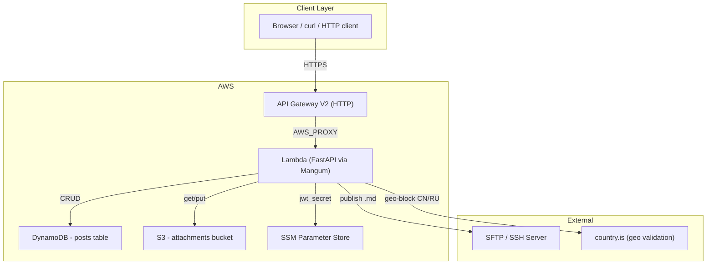
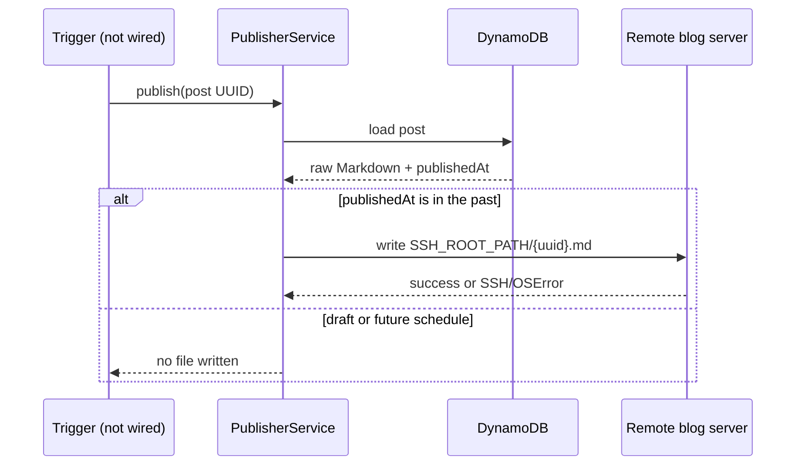
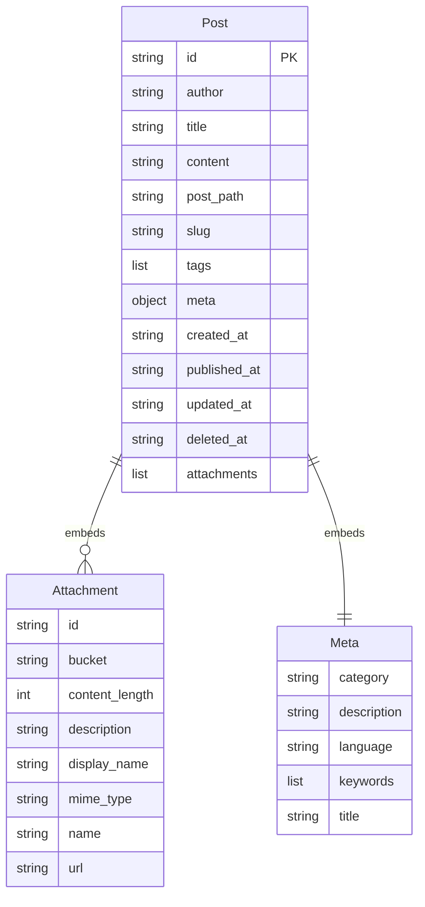
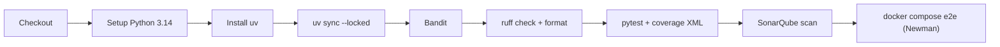

# personal-backend-service

> Serverless blog backend built with FastAPI, deployed on AWS Lambda via Terraform

**Copyright 2024-2026 mobal**

> ⚙️ This README was generated by AI

Licensed under the Apache License, Version 2.0 (the "License");
you may not use this file except in compliance with the License.
You may obtain a copy of the License at

    http://www.apache.org/licenses/LICENSE-2.0

Unless required by applicable law or agreed to in writing, software
distributed under the License is distributed on an "AS B" BASIS,
WITHOUT WARRANTIES OR CONDITIONS OF ANY KIND, either express or implied.
See the License for the specific language governing permissions and
limitations under the License.

---

## Overview

A production-grade personal blog backend. Posts are stored in **DynamoDB**, rendered from Markdown to HTML, and served via a **FastAPI** application running on **AWS Lambda** through **Mangum**. Attachments are stored in **S3** with public-read access. Auth is handled via **JWT** (HS256).

---

## Tech Stack

| Category | Technology |
|---|---|
| Framework | FastAPI |
| Runtime | Python 3.14+ |
| API Adapter | Mangum (AWS Lambda + API Gateway V2) |
| Database | DynamoDB (single table, 3 GSIs) |
| Object Storage | S3 (public-read attachments) |
| Auth | JWT (HS256, header or query param) |
| Markdown | python-markdown |
| Date/Time | Python stdlib `datetime` |
| Validation | Pydantic v2 (camelCase alias) |
| API Docs | OpenAPI 3.1 (auto-generated) |
| Lint / Format | Ruff |
| Type Checking | ty |
| Security | Bandit |
| CI | GitHub Actions (pytest, SonarQube, Newman e2e) |
| Deployment | Terraform (AWS) |

---

## Architecture



---

## API Endpoints

All routes are prefixed with `/api/v1`.

### Posts

| Method | Path | Auth | Description |
|---|---|---|---|
| POST | `/posts` | JWT | Create a new post |
| GET | `/posts` | No | List published posts (paginated) |
| GET | `/posts/{uuid}` | No | Get post by UUID |
| PUT | `/posts/{uuid}` | JWT | Update post |
| POST | `/posts/{uuid}/publish` | JWT | Write post Markdown to the remote blog server |
| DELETE | `/posts/{uuid}` | JWT | Soft-delete post |
| GET | `/posts/archive` | No | Archive grouped by year-month |
| GET | `/posts/{year}/{month}/{day}/{slug}` | No | Get post by date path + slug |

---

## API Documentation (OpenAPI)

The FastAPI app serves an auto-generated OpenAPI 3.1 document describing
every endpoint:

| Path | What |
|---|---|
| `/openapi.json` | Machine-readable schema (JSON) |
| `/docs` | Interactive Swagger UI |
| `/redoc` | ReDoc UI |

The schema is enriched with:

- **App metadata** - title, version, Apache-2.0 license and the API
  conventions (camelCase JSON, error envelope, correlation header) in the
  top-level `description`.
- **Tag groups** - `posts`, `attachments`, and `system` (`/health`).
- **Authentication** - protected operations declare the `HTTPBearer`
  security scheme (`Authorization: Bearer <token>` or `?token=<token>`),
  documented under `components.securitySchemes`.
- **Error responses** - every possible `4xx` references the
  `ErrorResponse` / `ValidationErrorResponse` schemas, matching the real
  error body instead of a generic framework model.
- **Descriptions & examples** - per-operation summaries, path/query
  parameter examples, and full-body request examples on `CreatePost`,
  `UpdatePost` and `CreateAttachment`.

To inspect or export the schema while developing:

```bash
uv run uvicorn app.api_handler:app --port 8080   # terminal 1
curl -s http://localhost:8080/openapi.json | jq . > openapi.json
```

The paths above are served wherever the app runs - local uvicorn as well as
the Lambda/API Gateway deployment.

---

### Attachments

Nested under posts: `/posts/{postUuid}/attachments`

| Method | Path | Auth | Description |
|---|---|---|---|
| POST | `` | JWT | Add attachment (base64) |
| GET | `` | No | List attachments |
| GET | `/{attachmentUuid}` | No | Get attachment metadata |

## Posting and publishing

Posting and publishing are separate operations. A post is first saved as a
Markdown document in DynamoDB. The optional `publishedAt` field is then used
to decide whether it belongs in public results, while the publisher sends the
raw Markdown to the blog server over SSHFS/SFTP.

```mermaid
flowchart LR
    A["Author"] -->|POST /api/v1/posts\nJWT required| B["Draft post\nDynamoDB"]
    B -->|PUT /api/v1/posts/{uuid}\nset publishedAt| C["Scheduled post"]
    C -->|when publishedAt is in the past| D["PublisherService"]
    D -->|write {post.id}.md| E["Remote blog server\nSSHFS/SFTP"]
    B -->|public API reads| F["FastAPI\nHTML-rendered Markdown"]
    C -->|public API reads| F
```

### Create a post

`POST /api/v1/posts` requires a JWT and creates a DynamoDB item. Omit
`publishedAt` (or send `null`) for a draft. The response is `201 Created` with
the new UUID in the `Location` header and no response body.

```bash
curl -i -X POST "$API_URL/api/v1/posts" \
  -H "Authorization: Bearer $JWT" \
  -H "Content-Type: application/json" \
  --data @post.json
```

The request body uses camelCase JSON. The Markdown remains unrendered in
storage; reads convert it to sanitized HTML.

Changing a title also regenerates the slug and date-based `postPath` from the
original creation date. Clients should treat the resulting public URL as
changed after a title update.

### Schedule or publish a post

`PUT /api/v1/posts/{uuid}` is a partial update. Set `publishedAt` to an ISO
8601 timestamp to schedule a post, or to a timestamp in the past to make it
eligible for publishing:

```bash
curl -i -X PUT "$API_URL/api/v1/posts/$POST_ID" \
  -H "Authorization: Bearer $JWT" \
  -H "Content-Type: application/json" \
  --data '{"publishedAt":"2026-09-12T09:00:00+00:00"}'
```

The implemented `PublisherService.publish(post_id)` performs this final
step:



Each due publish attempt records `publishStatus` (`publishing`, `published`,
or `failed`), `publishAttemptedAt`, and `publishError` on the DynamoDB item.
The remote filename is deterministic (`{post.id}.md`), so retrying a failed
publish safely overwrites the same document instead of creating duplicates.

`POST /api/v1/posts/{uuid}/publish` is the explicit authenticated publish
trigger. Updating `publishedAt` controls public visibility; it does not itself
perform the remote write. A scheduler or deployment workflow can call this
endpoint for due posts if automatic publication is required.

### Publishing status and public-read behavior

| Operation | Current behavior |
|---|---|
| `GET /posts` | Includes non-deleted posts whose `publishedAt` is in the past |
| `GET /posts/archive` | Groups non-deleted posts whose `publishedAt` is in the past |
| Date/slug and UUID reads | Return only non-deleted posts whose `publishedAt` is in the past |
| Remote publication | Writes raw Markdown through the authenticated publish endpoint |

The API treats a post as public only when its publication timestamp is due.
Sending `publishedAt: null` through `PUT /posts/{uuid}` returns it to draft
status.

---

## Data Model



**DynamoDB table**: `{stage}-posts`
- Hash key: `id` (UUID)
- GSI `PostPathIndex` on `post_path`
- GSI `TitleIndex` on `title`
- GSI `CreatedAtIndex` on `created_at`

**Soft-delete pattern**: Posts with a non-null `deleted_at` are excluded from all queries.

---

## Settings (Environment Variables)

23 configuration values sourced from env vars:

| Variable | Example |
|---|---|
| `APP_NAME` | personal-backend-service |
| `ATTACHMENTS_BUCKET_NAME` | dev-attachments-xxxxx |
| `AWS_ACCESS_KEY_ID` | ... |
| `AWS_SECRET_ACCESS_KEY` | ... |
| `AWS_DEFAULT_REGION` | eu-central-1 |
| `DEBUG` | true/false |
| `DEFAULT_TIMEZONE` | Europe/Budapest |
| `JWT_SECRET_SSM_PARAM_NAME` | /dev/secrets/jwt |
| `SSH_HOST` / `SSH_USERNAME` / `SSH_PASSWORD` / `SSH_ROOT_PATH` | SFTP publish target |
| `RATE_LIMIT_DURATION_IN_SECONDS` | 60 |
| `RATE_LIMIT_REQUESTS` | 60 |
| `RATE_LIMITING` | true/false |
| `STAGE` | dev |

---

## Middleware

Three custom middlewares run on every request:

1. **CorrelationIdMiddleware** - injects `X-Correlation-ID` header (from request or AWS request ID or new UUID)
2. **ClientValidationMiddleware** - geo-blocks requests from China (CN) and Russia (RU) via `country.is`
3. **RateLimitingMiddleware** - per-IP rate limiting with configurable window and threshold

Error responses use a standard `ErrorResponse` shape: `{ status, id, message }`.

---

## Terraform Infrastructure

| Resource | Description |
|---|---|
| `aws_apigatewayv2_api` | HTTP API Gateway |
| `aws_lambda_function` | FastAPI handler (Python 3.14, 768 MB, 15 s timeout) |
| `aws_lambda_layer_version` | Dependencies layer (built via Docker) |
| `aws_dynamodb_table` | Posts table with 3 GSIs |
| `aws_s3_bucket` | Attachments bucket (public-read) |
| `aws_iam_role` / `aws_iam_policy` | Lambda IAM: DynamoDB CRUD + SSM + ENI + CloudWatch |
| `aws_lambda_permission` | API Gateway invoke permission |

Lambda layer is built inside a Docker container (`public.ecr.aws/sam/build-python3.14`) to produce platform-compatible wheels.

---

## CI/CD Pipeline (GitHub Actions)

`.github/workflows/ci.yml` runs on every push. The `build-and-test` job
mirrors the Makefile targets; the `newman` job (last gate, needs
`build-and-test`) replays the Docker end-to-end suite.



Stages (`build-and-test`):
- **Bandit** (high severity, high confidence)
- **ruff** (lint + format check)
- **pytest** (branch coverage; XML report uploaded to Codecov/SonarQube)
- **SonarQube** (Python analysis + coverage)

Docker end-to-end (`newman` job):
- Builds the app image and starts LocalStack (DynamoDB, SSM, S3),
  seeded by `scripts/init_localstack.py`
- Starts the app gated on LocalStack's healthcheck and runs the Postman
  collection with Newman (`/health`, post CRUD, archive, auth failures,
  attachments)

---

## Quick Start

```bash
# Install dependencies
uv sync

# Run locally (hot-reload)
uv run uvicorn app.api_handler:app --reload --port 8080

# Run tests
pytest

# Unit tests only
pytest tests/unit

# Integration tests only
pytest tests/integration

# Lint
uv run ruff check app/ tests/

# Format
uv run ruff format --check app/ tests/

# Type check
uv run ty check

# Security scan
uv run bandit --severity-level high --confidence-level high -r app/
```

---

## Makefile

| Target | Description |
|---|---|
| `all` | bandit + format + lint + test |
| `build` | Build Lambda deployment package + layer (Docker) |
| `format` | `ruff format app/ tests/` |
| `install` | `uv sync` |
| `lint` | `ruff check app/ tests/ --fix` |
| `test` | pytest with branch coverage (DynamoDB/SSM/S3 via moto) |
| `tflint` | Terraform lint (`infrastructure/`) |
| `bandit` | Security scan |
| `ty` | Static type check |

---

## Project Structure

```
app/
├── api_handler.py          # FastAPI app, Mangum handler, error handlers
├── dependencies.py         # DI providers (services, repositories, JWT)
├── settings.py             # Pydantic settings (env vars + SSM secrets)
├── jwt_bearer.py           # JWT auth (Bearer header + token query param)
├── middlewares.py          # Correlation ID, geo-block (country.is), rate limiting
├── exceptions.py           # PostNotFoundException, AttachmentNotFoundException, etc.
├── api/
│   └── v1/
│       ├── api.py          # /api/v1 router mount (posts, attachments)
│       └── routers/
│           ├── posts_router.py        # 8 post endpoints (OpenAPI annotated)
│           └── attachments_router.py  # 3 attachment endpoints (OpenAPI annotated)
├── models/
│   ├── auth.py             # JWTToken model
│   ├── post.py             # Post, Attachment, Meta models
│   ├── response.py         # API envelope models (Post, Page, ErrorResponse)
│   └── camel_model.py      # CamelCase alias generator
├── schemas/
│   ├── post_schema.py      # CreatePost, UpdatePost (descriptions + examples)
│   └── attachment_schema.py # CreateAttachment (descriptions + examples)
├── services/
│   ├── post_service.py         # Business logic (CRUD, archive, markdown)
│   ├── attachment_service.py   # S3 upload + post attachment link
│   ├── publisher_service.py    # SFTP publish via SSHFS
│   ├── rate_limiter_service.py # Per-IP sliding-window rate limiting
│   ├── s3_storage_service.py   # S3 CRUD wrapper
│   └── sshfs_storage_service.py# SSHFS storage wrapper
└── repositories/
    └── post_repository.py  # DynamoDB data access

tests/
├── unit/
│   ├── service/            # Unit tests per service
│   ├── repository/         # PostRepository tests
│   └── test_auth.py        # JWT auth tests
└── integration/
    ├── test_posts_api.py
    └── test_attachments_api.py

terraform/*.tf              # Infra: API Gateway, Lambda, DynamoDB, S3, IAM

.github/workflows/ci.yml    # CI: Bandit, Ruff, pytest, SonarQube, Newman e2e
postman/                    # Newman e2e collection
scripts/                    # LocalStack seeding, Lambda build/packaging
```

---

## Key Design Decisions

- **Markdown rendering on read** - Content is stored as Markdown and rendered to HTML only when fetched. This keeps raw source available for SFTP publishing.
- **CamelCase API** - Pydantic `alias_generator=to_camel` lets Python use snake_case internally while exposing camelCase JSON.
- **Embedded attachments** - Attachments are stored as a list within the Post DynamoDB item (no separate table).
- **Soft-delete** - `deleted_at` timestamp; deleted posts are filtered out via DynamoDB `FilterExpression`.
- **SFTP publisher** - `PublisherService` uses `sshfs` to write `.md` files to a remote server after their `published_at` is in the past.
- **JWT from SSM** - The JWT secret is fetched from AWS SSM Parameter Store at runtime, not stored in env.

## Release review

The previously identified publish blockers and high-priority metadata and
delivery findings are implemented. Before launch, verify the remote SSH
credentials, blog-server permissions, and an operational retry schedule for
posts whose `publishStatus` is `failed`.
