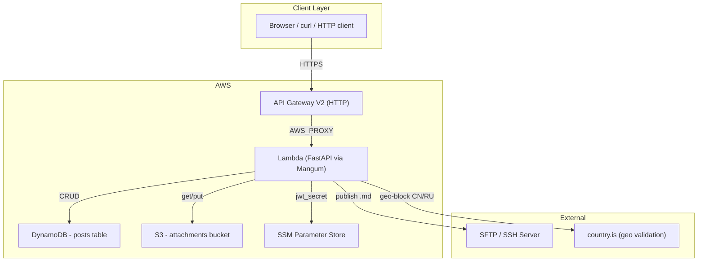
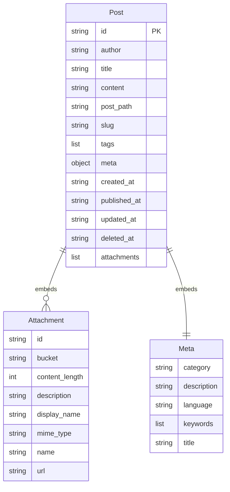
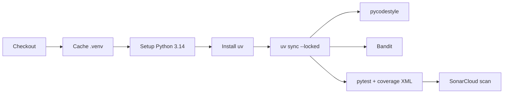

# personal-backend-service

> Serverless blog backend built with FastAPI, deployed on AWS Lambda via Terraform

**Copyright 2024-2026 mobal**

> ⚙️ This README was generated by AI

Licensed under the Apache License, Version 2.0 (the "License");
you may not use this file except in compliance with the License.
You may obtain a copy of the License at

    http://www.apache.org/licenses/LICENSE-2.0

Unless required by applicable law or agreed to in writing, software
distributed under the License is distributed on an "AS B" BASIS,
WITHOUT WARRANTIES OR CONDITIONS OF ANY KIND, either express or implied.
See the License for the specific language governing permissions and
limitations under the License.

---

## Overview

A production-grade personal blog backend. Posts are stored in **DynamoDB**, rendered from Markdown to HTML, and served via a **FastAPI** application running on **AWS Lambda** through **Mangum**. Attachments are stored in **S3** with public-read access. Auth is handled via **JWT** (HS256).

---

## Tech Stack

| Category | Technology |
|---|---|
| Framework | FastAPI |
| Runtime | Python 3.14+ |
| API Adapter | Mangum (AWS Lambda + API Gateway V2) |
| Database | DynamoDB (single table, 3 GSIs) |
| Object Storage | S3 (public-read attachments) |
| Auth | JWT (HS256, header or query param) |
| Markdown | python-markdown |
| Date/Time | Pendulum |
| Validation | Pydantic v2 (camelCase alias) |
| Linter | pycodestyle |
| Type Checking | mypy |
| Security | Bandit |
| CI | GitHub Actions + SonarCloud |
| Deployment | Terraform (AWS) |

---

## Architecture



---

## API Endpoints

All routes are prefixed with `/api/v1`.

### Posts

| Method | Path | Auth | Description |
|---|---|---|---|
| POST | `/posts` | JWT | Create a new post |
| GET | `/posts` | No | List published posts (paginated) |
| GET | `/posts/{uuid}` | No | Get post by UUID |
| PUT | `/posts/{uuid}` | JWT | Update post |
| DELETE | `/posts/{uuid}` | JWT | Soft-delete post |
| GET | `/posts/archive` | No | Archive grouped by year-month |
| GET | `/posts/{year}/{month}/{day}/{slug}` | No | Get post by date path + slug |

### Attachments

Nested under posts: `/posts/{postUuid}/attachments`

| Method | Path | Auth | Description |
|---|---|---|---|
| POST | `` | JWT | Add attachment (base64) |
| GET | `` | No | List attachments |
| GET | `/{attachmentUuid}` | No | Get attachment metadata |

---

## Data Model



**DynamoDB table**: `{stage}-posts`
- Hash key: `id` (UUID)
- GSI `PostPathIndex` on `post_path`
- GSI `TitleIndex` on `title`
- GSI `CreatedAtIndex` on `created_at`

**Soft-delete pattern**: Posts with a non-null `deleted_at` are excluded from all queries.

---

## Settings (Environment Variables)

23 configuration values sourced from env vars:

| Variable | Example |
|---|---|
| `APP_NAME` | personal-backend-service |
| `ATTACHMENTS_BUCKET_NAME` | dev-attachments-xxxxx |
| `AWS_ACCESS_KEY_ID` | ... |
| `AWS_SECRET_ACCESS_KEY` | ... |
| `AWS_DEFAULT_REGION` | eu-central-1 |
| `DEBUG` | true/false |
| `DEFAULT_TIMEZONE` | Europe/Budapest |
| `JWT_SECRET_SSM_PARAM_NAME` | /dev/secrets/jwt |
| `SSH_HOST` / `SSH_USERNAME` / `SSH_PASSWORD` / `SSH_ROOT_PATH` | SFTP publish target |
| `RATE_LIMIT_DURATION_IN_SECONDS` | 60 |
| `RATE_LIMIT_REQUESTS` | 60 |
| `RATE_LIMITING` | true/false |
| `STAGE` | dev |

---

## Middleware

Three custom middlewares run on every request:

1. **CorrelationIdMiddleware** - injects `X-Correlation-ID` header (from request or AWS request ID or new UUID)
2. **ClientValidationMiddleware** - geo-blocks requests from China (CN) and Russia (RU) via `country.is`
3. **RateLimitingMiddleware** - per-IP rate limiting with configurable window and threshold

Error responses use a standard `ErrorResponse` shape: `{ status, id, message }`.

---

## Terraform Infrastructure

| Resource | Description |
|---|---|
| `aws_apigatewayv2_api` | HTTP API Gateway |
| `aws_lambda_function` | FastAPI handler (Python 3.14, 768 MB, 15 s timeout) |
| `aws_lambda_layer_version` | Dependencies layer (built via Docker) |
| `aws_dynamodb_table` | Posts table with 3 GSIs |
| `aws_s3_bucket` | Attachments bucket (public-read) |
| `aws_iam_role` / `aws_iam_policy` | Lambda IAM: DynamoDB CRUD + SSM + ENI + CloudWatch |
| `aws_lambda_permission` | API Gateway invoke permission |

Lambda layer is built inside a Docker container (`public.ecr.aws/sam/build-python3.14`) to produce platform-compatible wheels.

---

## CI/CD Pipeline (GitHub Actions)

`.github/workflows/workflow.yml` runs on every push:



Stages:
- **pycodestyle** (strict mode, ignores E501/W503)
- **Bandit** (high severity, high confidence)
- **pytest** (branch coverage, HTML + XML report)
- **SonarCloud** (coverage upload, Python analysis)

---

## Quick Start

```bash
# Install dependencies
uv sync

# Run locally (hot-reload)
uv run uvicorn app.api_handler:app --reload --port 8080

# Run tests
pytest

# Unit tests only
pytest tests/unit

# Integration tests only
pytest tests/integration

# Lint
uv run pycodestyle --ignore=E501,W503 app/ tests/

# Type check
uv run mypy app/ --explicit-package-bases

# Security scan
uv run bandit --severity-level high --confidence-level high -r app/
```

---

## Makefile

| Target | Description |
|---|---|
| `all` | black + pycodestyle + sort + test |
| `black` | Format code |
| `flake` | Remove unused imports/variables |
| `install` | `uv sync` |
| `mypy` | Type checking |
| `pycodestyle` | Lint |
| `serve` | `uvicorn app.api_handler:app` |
| `sort` | isort |
| `test` | pytest with 90% coverage floor |
| `unit-test` | Tests unit only |
| `integration-test` | Tests integration only |
| `bandit` | Security scan |
| `upgrade` | `uv sync --upgrade` |

```makefile
all: black flake pycodestyle sort test

black:
	uv run -m black --verbose ./

flake:
	uv run -m autoflake --in-place --recursive \
	  --remove-all-unused-imports --remove-unused-variables \
	  app/*.py tests/*.py

install:
	uv sync

mypy:
	uv run -m mypy app/ --explicit-package-bases

pycodestyle:
	uv run -m pycodestyle --ignore=E501,W503 app/ tests/

serve:
	uv run -m uvicorn app.api_handler:app

sort:
	uv run -m isort --atomic app/ tests/

test:
	uv run -m pytest --cov-fail-under=90

unit-test:
	uv run -m pytest tests/unit

integration-test:
	uv run -m pytest tests/integration

bandit:
	uv run -m bandit --severity-level high --confidence-level high -r app/ -vvv

upgrade:
	uv sync --upgrade
```

---

## Project Structure

```
app/
├── api_handler.py          # FastAPI app, Mangum handler, error handlers
├── settings.py             # Pydantic Settings (23 env vars)
├── jwt_bearer.py           # JWT auth (Bearer header + query param fallback)
├── middlewares.py          # Correlation ID, geo-block, rate limiting
├── exceptions.py           # PostNotFoundException, AttachmentNotFoundException, etc.
├── api/
│   └── v1/
│       ├── api.py          # Router mount
│       └── routers/
│           ├── posts_router.py        # 7 post endpoints
│           └── attachments_router.py  # 3 attachment endpoints
├── models/
│   ├── auth.py             # JWTToken model
│   ├── post.py             # Post, Attachment, Meta models
│   ├── response.py         # Post + Page response models
│   └── camel_model.py      # CamelCase alias generator
├── schemas/
│   ├── post_schema.py      # CreatePost, UpdatePost
│   └── attachment_schema.py # CreateAttachment
├── services/
│   ├── post_service.py     # Business logic (CRUD, archive, markdown)
│   ├── attachment_service.py # S3 upload + post attachment link
│   ├── publisher_service.py  # SFTP publish via SSHFS
│   └── storage_service.py    # S3 CRUD wrapper
└── repositories/
    └── post_repository.py  # DynamoDB data access

tests/
├── unit/
│   ├── service/            # Unit tests for each service
│   ├── repository/         # PostRepository tests
│   └── test_auth.py        # JWT auth tests
└── integration/
    ├── test_posts_api.py
    └── test_attachments_api.py

terraform/*.tf              # Infra: API Gateway, Lambda, DynamoDB, S3, IAM

.github/workflows/          # CI: pycodestyle, Bandit, pytest, SonarCloud
```

---

## Key Design Decisions

- **Markdown rendering on read** - Content is stored as Markdown and rendered to HTML only when fetched. This keeps raw source available for SFTP publishing.
- **CamelCase API** - Pydantic `alias_generator=to_camel` lets Python use snake_case internally while exposing camelCase JSON.
- **Embedded attachments** - Attachments are stored as a list within the Post DynamoDB item (no separate table).
- **Soft-delete** - `deleted_at` timestamp; deleted posts are filtered out via DynamoDB `FilterExpression`.
- **SFTP publisher** - `PublisherService` uses `sshfs` to write `.md` files to a remote server after their `published_at` is in the past.
- **JWT from SSM** - The JWT secret is fetched from AWS SSM Parameter Store at runtime, not stored in env.
