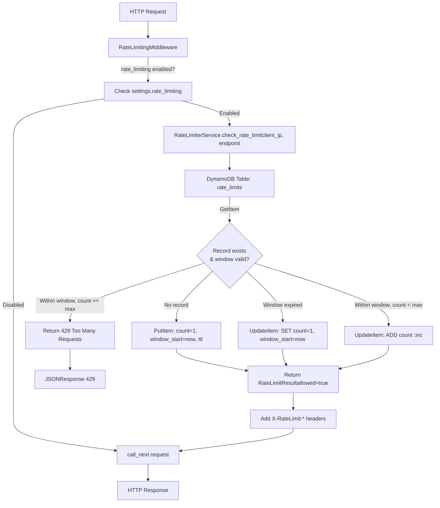
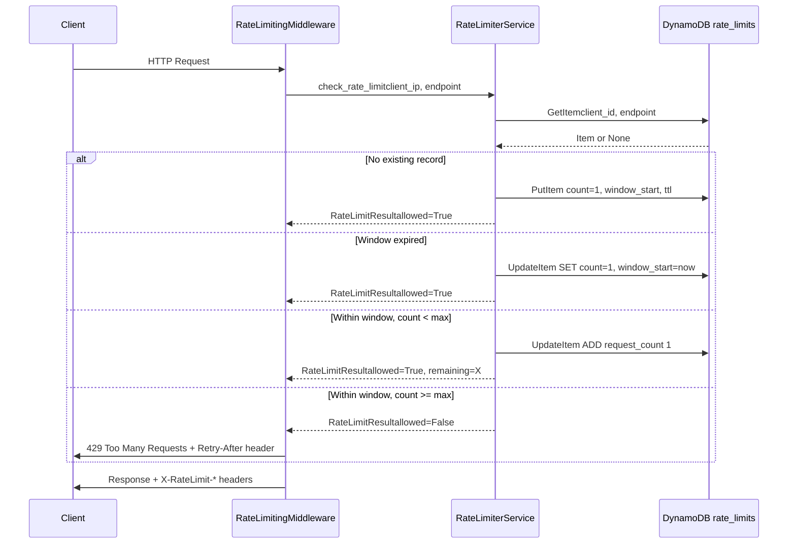

# DynamoDB Rate Limiting Cache — Implementation Plan

## Overview

Replace the in-memory rate limiting in [`RateLimitingMiddleware`](app/middlewares.py:110) (which uses a global `dict[str, Any]`) with a DynamoDB-backed solution for production scalability across multiple Lambda instances.

---

## Analysis of Current State vs. Requirements

| Aspect | Current State | Target State |
|--------|--------------|--------------|
| Storage | In-memory `clients: dict[str, Any]` ([line 27](app/middlewares.py:27)) | DynamoDB `rate_limits` table |
| Scalability | Single Lambda instance only | Multiple concurrent Lambda instances |
| Persistence | Lost on restart | Survives restarts via TTL |
| Key schema | Client IP only | Composite: `client_id` (HASH) + `endpoint` (RANGE) |
| Settings | `rate_limiting` flag already exists ([line 18](app/settings.py:18)) | Already sufficient — no changes needed |
| Rate limit params | `rate_limit_requests` (100) & `rate_limit_duration_in_seconds` (60) | Already defined in settings |

---

## Files to Modify / Create

### 1. Infrastructure: DynamoDB Table — [`infrastructure/dynamodb.tf`](infrastructure/dynamodb.tf)

Add a new `aws_dynamodb_table` resource for rate limits:

| Property | Value |
|----------|-------|
| Table name | `${var.stage}-rate-limits` |
| Partition key | `client_id` (String) |
| Sort key | `endpoint` (String) |
| Billing mode | `PAY_PER_REQUEST` |
| TTL attribute | `ttl` (enabled) |

### 2. Infrastructure: IAM Permissions — [`infrastructure/iam.tf`](infrastructure/iam.tf)

Extend the existing `lambda_policy` to include DynamoDB actions on the new `rate_limits` table:
- `dynamodb:GetItem`
- `dynamodb:PutItem`
- `dynamodb:UpdateItem`
- `dynamodb:DeleteItem`

### 3. Rate Limiting Service — NEW: [`app/services/rate_limiter_service.py`](app/services/rate_limiter_service.py)

Create a dedicated service class (`RateLimiterService`) encapsulating all DynamoDB rate-limit logic. This follows the existing service/repository pattern (see [`app/services/post_service.py`](app/services/post_service.py)).

**Key design decisions:**

- **Uses `boto3` directly** (not `aws_lambda_powertools.utilities.dynamodb.DynamoDB`) to stay consistent with the rest of the codebase (see [`app/repositories/post_repository.py`](app/repositories/post_repository.py)).
- **Returns a dataclass** `RateLimitResult` with `allowed: bool`, `request_count: int`, `limit: int`, `remaining: int`, `reset_at: int` — not just a boolean — so the middleware can set proper rate-limit headers.
- **Atomic increments** via DynamoDB's `ADD` on `request_count`.
- **Window check** compares `window_start` against current time to reset counters.
- **TTL** set to `now + RATE_LIMIT_DURATION` for automatic cleanup.

```python
# Pseudocode for the service
class RateLimiterService:
    def __init__(self, stage: str):
        self._table = boto3.resource("dynamodb").Table(f"{stage}-rate-limits")
        self._max_requests = settings.rate_limit_requests
        self._window_duration = settings.rate_limit_duration_in_seconds

    def check_rate_limit(self, client_id: str, endpoint: str) -> RateLimitResult:
        now = datetime.now(timezone.utc).timestamp()
        window_start = now - self._window_duration

        # 1. Try to get existing record
        # 2. If none exists → create with count=1
        # 3. If window expired → reset count=1
        # 4. If within window and count >= max → BLOCK
        # 5. If within window and count < max → INCREMENT
        # Return RateLimitResult with headers data
```

### 4. Update Middleware — [`app/middlewares.py`](app/middlewares.py)

**Changes:**
- Remove the global `clients: dict[str, Any] = {}` ([line 27](app/middlewares.py:27))
- Inject `RateLimiterService` into `RateLimitingMiddleware`
- Update `_check_rate_limit` to call the service instead of the dict
- Update `_get_rate_limit_headers` to accept a `RateLimitResult` instead of a raw dict
- The endpoint for rate limiting should be `request.url.path`

### 5. Tests

#### 5a. Unit Tests — NEW: [`tests/unit/service/test_rate_limiter_service.py`](tests/unit/service/test_rate_limiter_service.py)

Test `RateLimiterService` in isolation using `moto`:

| Test Case | Description |
|-----------|-------------|
| First request creates record | No existing item → creates with count=1, returns allowed |
| Subsequent request increments | Existing item within window → increments count, returns allowed |
| Rate limit exceeded | Count >= max → returns blocked (429) |
| Window expired resets | Old window_start → resets count=1, returns allowed |
| TTL is set on new records | Verify `ttl` attribute exists with future timestamp |
| Different endpoints tracked separately | Same client, different endpoints → independent counters |

#### 5b. Integration Tests — Update [`tests/integration/test_posts_api.py`](tests/integration/test_posts_api.py)

The existing integration tests use `TestClient` which triggers the middleware. Since the middleware currently uses the global `clients` dict, after the migration it will use DynamoDB. The integration conftest at [`tests/integration/conftest.py`](tests/integration/conftest.py) initializes the app — will need to ensure the `rate_limits` table is created in `moto` context.

**Key challenge:** The integration tests run against the full app with `TestClient`. The app's `RateLimitingMiddleware` is instantiated at import time. Since we're using `moto`, we need to ensure the DynamoDB mock is active when the middleware's `dispatch` is called. The existing integration tests don't mock DynamoDB for the posts table — they rely on `moto` being active via the `setup` fixture in [`tests/conftest.py`](tests/conftest.py:15).

**Update needed:** Add a fixture in `tests/integration/conftest.py` to create the `test-rate-limits` table in `moto` before the test client runs.

#### 5c. Update Existing Test Setup — [`tests/unit/conftest.py`](tests/unit/conftest.py)

Add a fixture for `RateLimiterService` similar to other service fixtures.

#### 5d. Clean Up Global State — [`tests/integration/test_posts_api.py`](tests/integration/test_posts_api.py)

The `setup_function` fixture currently clears `banned_hosts` and `country_cache`. The `clients` dict will be removed, so no cleanup needed for it.

### 6. Environments — No Changes Needed

- `.env.example` — already has `RATE_LIMIT_*` variables
- `pyproject.toml` — `boto3` is already a dependency; `aws-lambda-powertools` is in dev deps

---

## Architecture Diagram



## Data Flow Sequence



---

## Migration Steps (Execution Order)

### Step 1 — Create `RateLimiterService`
- File: [`app/services/rate_limiter_service.py`](app/services/rate_limiter_service.py) (NEW)
- Implement `check_rate_limit(client_id, endpoint) -> RateLimitResult` using `boto3`
- Follow existing patterns from [`PostRepository`](app/repositories/post_repository.py)

### Step 2 — Update `RateLimitingMiddleware`
- File: [`app/middlewares.py`](app/middlewares.py)
- Remove global `clients` dict
- Instantiate `RateLimiterService` (or accept as dependency)
- Update `_check_rate_limit` and `_get_rate_limit_headers` for new interface

### Step 3 — Add Terraform DynamoDB Table
- File: [`infrastructure/dynamodb.tf`](infrastructure/dynamodb.tf)
- Add `aws_dynamodb_table.rate_limits` resource

### Step 4 — Update IAM Policy
- File: [`infrastructure/iam.tf`](infrastructure/iam.tf)
- Add `rate_limits` table ARN and its actions to `lambda_policy`

### Step 5 — Write Unit Tests
- File: [`tests/unit/service/test_rate_limiter_service.py`](tests/unit/service/test_rate_limiter_service.py) (NEW)
- Test all branches: new record, existing, window expired, rate limited

### Step 6 — Update Integration Tests
- File: [`tests/integration/conftest.py`](tests/integration/conftest.py)
- Add `initialize_rate_limits_table` fixture
- File: [`tests/integration/test_posts_api.py`](tests/integration/test_posts_api.py)
- Update `setup_function` to no longer reference removed `clients` dict

### Step 7 — Update Test Fixtures
- File: [`tests/unit/conftest.py`](tests/unit/conftest.py)
- Add `rate_limiter_service` fixture

---

## Potential Risks & Mitigations

| Risk | Mitigation |
|------|------------|
| **Race condition**: Two Lambda instances increment simultaneously | DynamoDB `ADD` and conditional `UpdateItem` are atomic; use `ConditionExpression` with `attribute_exists` for create-vs-update |
| **DynamoDB cold start latency** for first request | Acceptable — ~10-20ms; TTL ensures no stale data |
| **Cost surge** from many concurrent clients | `PAY_PER_REQUEST` billing keeps costs proportional; ~$0.25/month estimated for 1000 clients |
| **TTL not immediate** (can take up to 48h) | Acceptable since the `window_start` comparison already handles expiration logically; TTL is for cost-saving cleanup only |
| **Breaking existing tests** that import `clients` | Search for all `from app.middlewares import ... clients` references and update |

---

## Deviations from Original Plan

1. **Replaced `aws_lambda_powertools.utilities.dynamodb.DynamoDB` with `boto3`** for consistency with the existing codebase pattern.
2. **Created a dedicated service** (`RateLimiterService`) instead of inline functions, following the project's service-layer architecture.
3. **Return a `RateLimitResult` dataclass** (not just `bool`) so the middleware can populate rate-limit response headers.
4. **Note:** `rate_limiting_enabled` flag in settings already exists as `rate_limiting` — no additional settings change needed.
